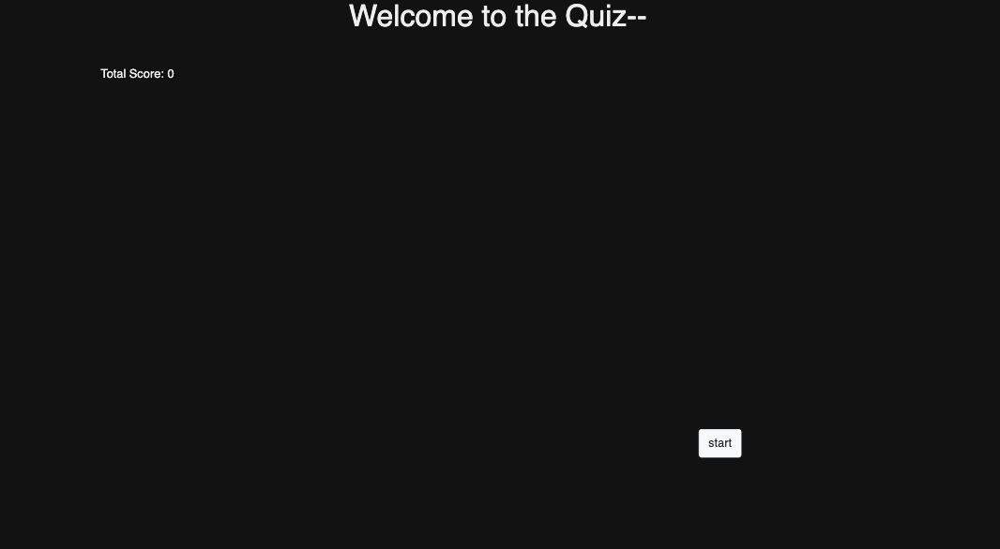
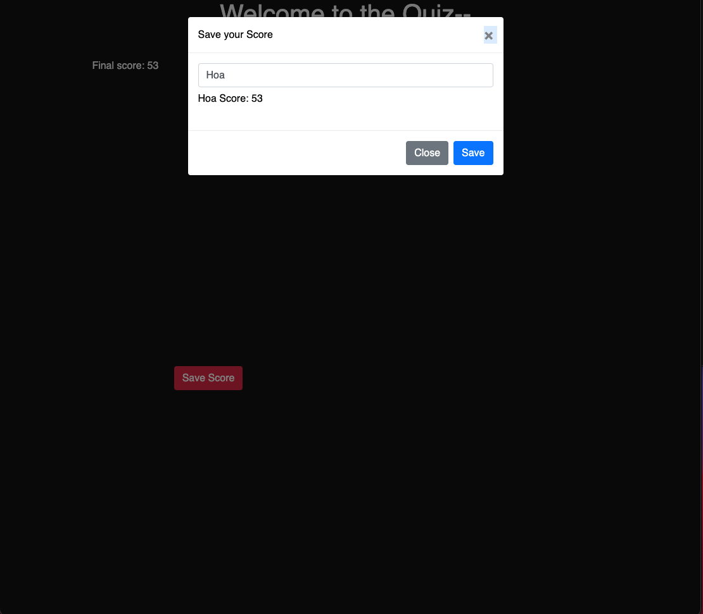

## What is this?

This a easy quiz about JavaScript

## How Do I play?
Click the start button ^^
<kbd></kbd>

What’s next?
Answer the question the questions.

If you answer it wrong you will get a chance to try again, but be careful you will lose time for each wrong answer.

Each correct answer will take you to the next page.

How do I save my score?
At the end of the quiz you will see a button that allows you to save your score.

<kbd></kbd>

Am I the best?

Probably not. The high scores are only based on local storage. You will only have access to the score that were recorded from your computer. But, maybe you are the best. I don't know.

## Score- What’s the deal?

The score is calculated by how many seconds left you have on the timer at the time you finish the quiz. If you choose the wrong answer you will lose 10 points.

## How Did I make this ?

I used bootstrap html css and primarily JavaScript.

## Known issues

At the time of writing this readme there are problems with add the score correctly. Also local storage has yet to be setup.